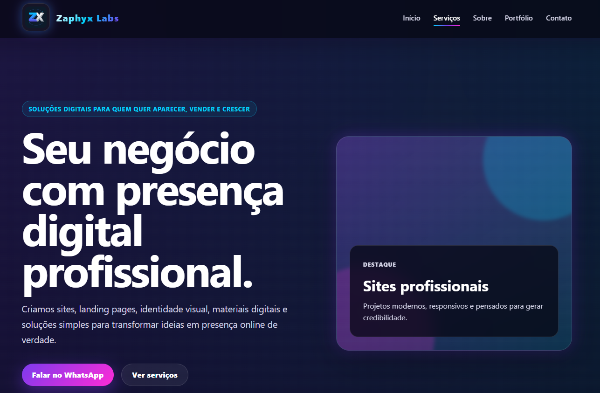
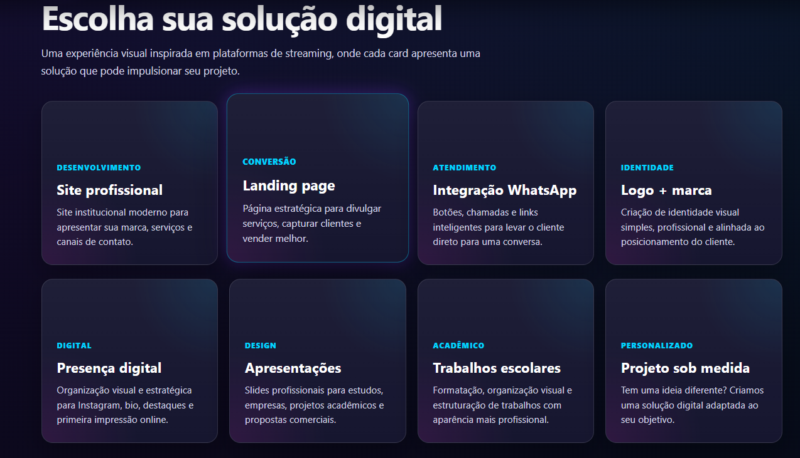
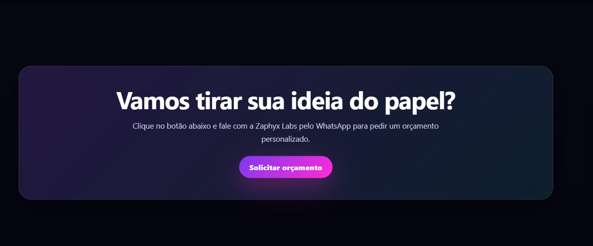
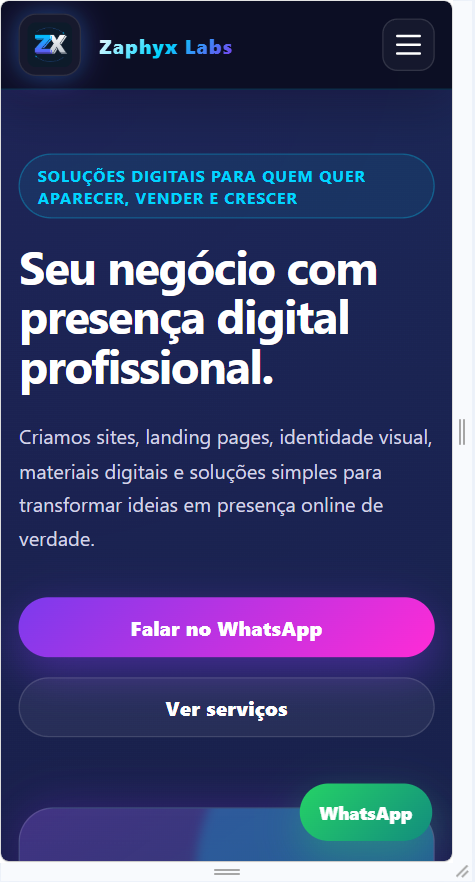
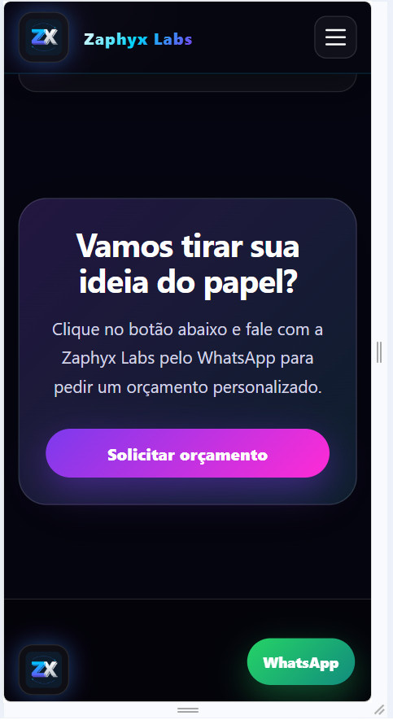

# 🚀 zaphyx-labs

## 📌 Sobre o projeto
Site institucional da **Zaphyx Labs**, uma empresa de soluções digitais focada em presença online, desenvolvimento web e identidade visual.

O objetivo do projeto é apresentar serviços de forma moderna, com uma interface inspirada em plataformas de streaming, oferecendo uma experiência visual impactante e profissional.

---

## ✨ Funcionalidades
- Interface estilo streaming (inspirado em Netflix)
- Cards interativos com serviços
- Botão direto para WhatsApp
- Layout responsivo (mobile + desktop)
- Design moderno com identidade tech

---

## 🧠 Serviços apresentados
- Desenvolvimento de sites profissionais
- Landing pages
- Integração com WhatsApp
- Criação de logo e identidade visual
- Presença digital (Instagram)
- Apresentações profissionais
- Trabalhos acadêmicos

---

## 🛠️ Tecnologias utilizadas
- HTML5
- CSS3 (design moderno + responsivo)
- JavaScript (interações)
- Git e GitHub
- Netlify (deploy)

---

## 🌐 Deploy
zaphyx-labs.netlify.app

---

## 🚧 Status do projeto
Em desenvolvimento contínuo.

---

## 🎯 Objetivo
Este projeto faz parte da construção do portfólio profissional e da criação de uma fonte de renda com serviços digitais.

---

## 👩‍💻 Autora
Josy
 
## 📸 Preview do projeto

© 2026 - Todos os direitos reservados.
